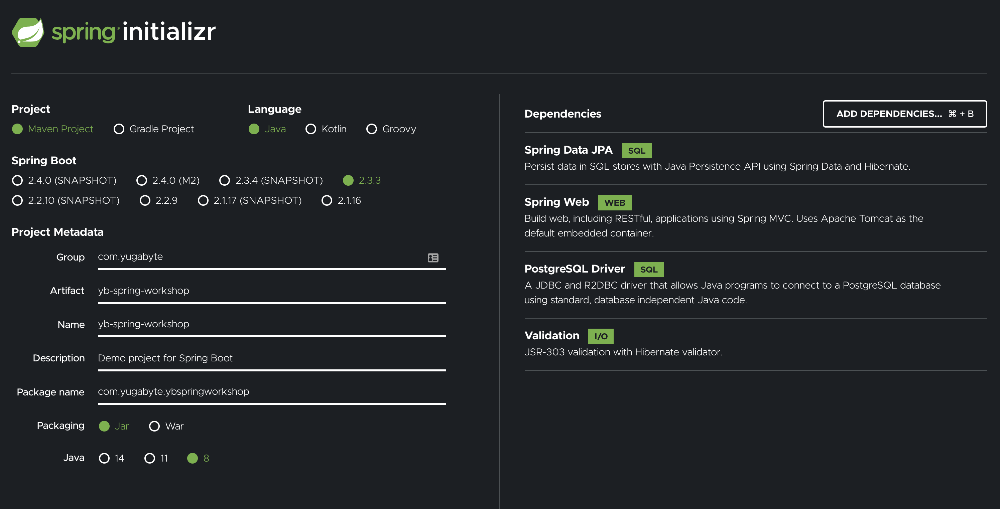

# Spring Boot App using Yugabyte YSQL API

Let's incrementally build our the Spring Boot app for simulating ecommerce API using Spring Data JPA and YugabyteDB.

## Create a new Spring Boot app

Lets navigate to https://start.spring.io for creating a new spring-boot skeleton project. Select the following required dependencies for building the app

* Spring Web
* Spring Data JPA
* PostgreSQL Driver
* Java 8

