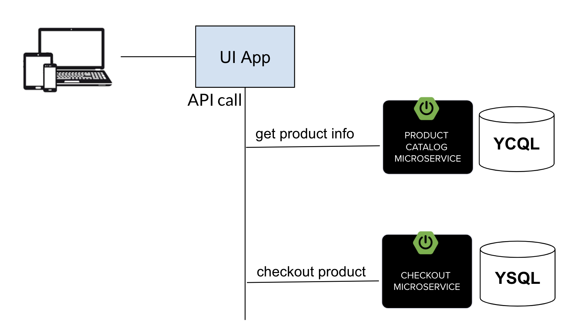

# YugabyteDB Spring Developer Workshop for VMware Tanzu

### What will we build in this workshop?

In this workshop, we'll look at how to build data-driven microservices apps using Spring Boot and Yugabyte Distributed SQL database. This will be focused on building a Retail Catalog lookup application use-case which is a low-latency, resilient, and HA lookup web-service. It will be a two hours hands-on session where developers will get started with developing the Product Catalog and Cart microservices using familar spring modules like Spring Web, Spring Data Cassandra and Spring Data JPA. YugabyteDB cluster access will be provided to all the participants via options like Yugabyte Cloud or Yugabyte cluster deployed on the customer environment. 

Session includes walk through of YugabyteDB concepts for app developers, slide deck and hands-on labs.

## Retail Catalog Lookup application

 Microservice         | YugabyteDB API | Spring Projects | Description           |
| -------------------- | ---------------- | ---------------- | --------------------- |
| [Product Catalog](https://github.com/yugabyte/spring-tanzu-workshop/tree/master/product-catalog-microservice) | YCQL | Spring Boot, Spring Web, Spring Data Cassandra | This microservice serves the product catalog lookup information. It uses Spring Data Cassandra repositories for querying the product catalog information stored in YugabyteDB YCQL Table.
| [Cart](https://github.com/yugabyte/spring-tanzu-workshop/tree/master/cart-microservice) | YSQL | Spring Boot, Spring Web, Spring Data JPA | This microservice handles the shopping cart functionality. It uses Spring Data JPA repositories for transactional commit into YugabyteDB YSQL Tables.

## Agenda

- YugabyteDB Fundamentals

- Deploying YugabyteDB on Tanzu Kubernetes Grid (TKG)

- Implementing Product Catalog Microservice using Yugabyte CQL API (NOSQL)

- Implementing Cart Microservice using Yugabyte SQL API (RDBMS)

- Putting it all together on Tanzu environment

## Prerequisites

- Basic understanding of Spring Data and Spring Boot
- Basic familiarity with YugabyteDB fundamentals - https://docs.yugabyte.com/latest/explore/
- Familiarity with running Linux commands and bash CLI
- IDE of choice - Eclipse or IntelliJ or SpringSource Toolkit preferred

## Technical Requirements

- Java 1.8 installed
- GitHub account
- Maven installed
- Docker desktop installed
- Internet access - ability to access sites via port 80 and 443 (HTTPS)

